# Assignment #2: Testing Reliability of Quorum Systems

---

- Name: Huiming Sun
- NetID: huiming5
- Quorum: [Raft(etcd)](https://github.com/etcd-io/etcd/tree/main/raft)
- [Raft Paper](https://raft.github.io/raft.pdf)
- [Report Repo](https://github.com/bamboovir/cs598_xu_assignments_2.git) Private, Ping me to get access

---

<div style="page-break-after: always;"></div>

## 1. Select a Quorum System

You can select any quorum system. If you do not have an idea what system to pick, we prepared a list for you. Please select one from the list and put your name down. Note that all the systems on the list are Raft implementations. You are welcome (and encouraged) to select systems built on other consensus protocols (e.g., Paxos, MultiPaxos, EPaxos, Copilot, etc).

### Q1 So, what is your quorum system of choice?

[Raft(etcd)](https://github.com/etcd-io/etcd/tree/main/raft)

<div style="page-break-after: always;"></div>

## 2. Run The Quorum System and Measure The Baseline Performance

You are responsible for compiling, building, and running the quorum systems you decide.

You can run your quorum system on one machine in a pseudo-distributed mode, where each node runs as a process connected through the local loopback. All the experiments in this assignment can be done with a pseudo-distributed setup.

Once you have a quorum system, find a client workload so that you can measure the performance of your quorum system. You should be able to find a client workload from the source-code repo, because developers need them to test their systems, too.

After all the hard work, you have a quorum system running happily on your machine.

<div style="page-break-after: always;"></div>

### Q2: Please describe your configuration

host machine config

```bash
# uname -a
Darwin Huimings-MacBook-Pro.local 21.1.0 Darwin Kernel Version 21.1.0 arm64
# sw_vers
ProductName:    macOS
ProductVersion: 12.0.1
BuildVersion:   21A559
# sysctl -n machdep.cpu.brand_string
Apple M1 Pro
# sysctl hw.ncpu
hw.ncpu: 8
# sysctl hw.memsize
hw.memsize: 34359738368
# system_profiler SPHardwareDataType
Hardware:
    Hardware Overview:
      Model Name: MacBook Pro
      Model Identifier: MacBookPro18,3
      Chip: Apple M1 Pro
      Total Number of Cores: 8 (6 performance and 2 efficiency)
      Memory: 32 GB
```

docker config

```bash
# docker info
Client:
 Context:    default
 Debug Mode: false
 Plugins:
  buildx: Build with BuildKit (Docker Inc., v0.6.3)
  compose: Docker Compose (Docker Inc., v2.1.1)
  scan: Docker Scan (Docker Inc., 0.9.0)

Server:
 Server Version: 20.10.10
 Storage Driver: overlay2
  Backing Filesystem: extfs
  Supports d_type: true
  Native Overlay Diff: true
  userxattr: false
 Logging Driver: json-file
 Cgroup Driver: cgroupfs
 Cgroup Version: 1
 Plugins:
  Volume: local
  Network: bridge host ipvlan macvlan null overlay
  Log: awslogs fluentd gcplogs gelf journald json-file local logentries splunk syslog
 Swarm: inactive
 Runtimes: io.containerd.runc.v2 io.containerd.runtime.v1.linux runc
 Default Runtime: runc
 Init Binary: docker-init
 containerd version: 5b46e404f6b9f661a205e28d59c982d3634148f8
 runc version: v1.0.2-0-g52b36a2
 init version: de40ad0
 Security Options:
  seccomp
   Profile: default
 Kernel Version: 5.10.47-linuxkit
 Operating System: Docker Desktop
 OSType: linux
 Architecture: aarch64
 CPUs: 5
 Total Memory: 7.765GiB
 Name: docker-desktop
 ID: 4KK3:FDMH:QOUU:MSMD:74K3:HDUN:DAY4:AP4S:NER3:P2V4:2VAE:G5FV
 Docker Root Dir: /var/lib/docker
 Debug Mode: false
 HTTP Proxy: http.docker.internal:3128
 HTTPS Proxy: http.docker.internal:3128
 Registry: https://index.docker.io/v1/
 Labels:
 Experimental: false
 Insecure Registries:
  127.0.0.0/8
 Live Restore Enabled: false
```

etcd / etcd(raft) config

```bash
# cd ./raft/etcd/
# git rev-parse HEAD
bdb13e2e12d44a6eb83d35f7867e3c6b9385655b
# etcd(raft)
go.etcd.io/etcd/raft/v3 v3.5.0
```

go config

```bash
# go version
go version go1.17.2 darwin/arm64
```

raft cluster size = `3` ｜ `5` (Configurable)

Basically, I used the configuration/architecture as shown below for this experiment.
All docker images are native, not emulated using qemu, and do not use any CPU and memory limits for `baseline`.
Although I successfully compiled `etcd` and `etcd-benchmark`, I did not use them directly to observe the performance of `etcd raft`.
Instead, I wrote a minimal product using the `etcd raft` library and injected metrics middleware to observe performance.
This is mainly for the following reasons.

1. I need to observe the performance of `etcd raft` not `etcd`. Evaluating `etcd raft` directly can rule out the influence of other factors.
2. The `etcd-benchmark` implementation is too customized and lacks some performance metrics I need in this report.

Implementation code built with `etcd raft` can be found in `./raft`, a standard `golang` project.
You can find more information in the [raft](./raft/README.md) documentation.

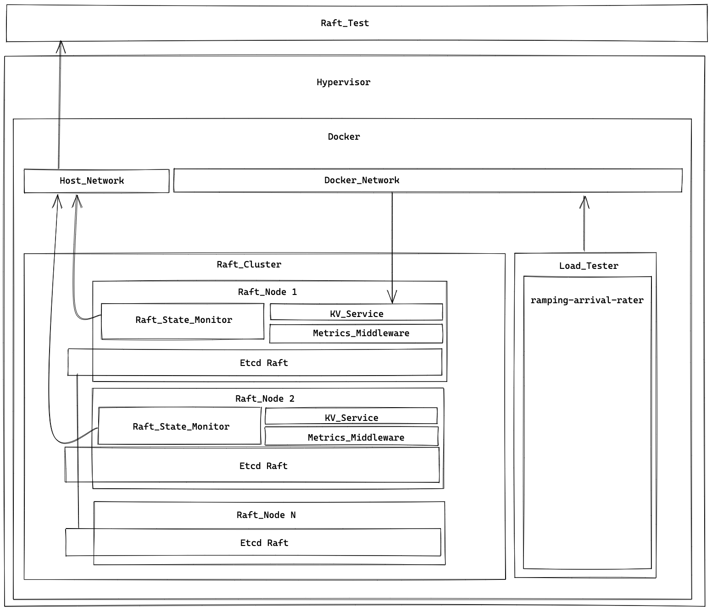

<div style="page-break-after: always;"></div>

### Q3: What is your client workload?

I used [k6](https://k6.io/docs/) as a load testing framework.
For `baseline` I used [ramping_arrival_rate](https://k6.io/docs/using-k6/scenarios/executors/ramping-arrival-rate/) executor (./hypervisor/load_test/basic_payload.js),
Increase the Requests per second (RPS) by 10 every 20s starting from 0. This process will not stop until the RPS reaches 500.
This will be done using a pre-allocated pool of 100 concurrent clients.
When the client pool cannot meet the demand, a new client pool will be allocated to ensure that the RPS meets the set standard.
When `baseline` performance is determined, I will use [constant_arrival_rate](https://k6.io/docs/using-k6/scenarios/executors/constant-arrival-rate) to maintain a constant 350 RPS (./ hypervisor/load_test/const_payload.js)

```js
export const options = {
  discardResponseBodies: true,
  scenarios: {
    ramping_arrival_rate: {
      executor: 'ramping-arrival-rate',
      startRate: 0,
      timeUnit: '1s',
      preAllocatedVUs: 200,
      maxVUs: 250,
      stages: [
        { target: 0, duration: '1s' },
        { target: 0, duration: '19s' },
        { target: 10, duration: '1s' },
        { target: 10, duration: '19s' },
        ...
        { target: 500, duration: '1s' },
        { target: 500, duration: '19s' },
      ],
    },
  },
};
```

<div style="page-break-after: always;"></div>

### Q4: What is your baseline performance? Plot the throughput-latency figure (how does such a paper look like? the x-axis is the throughput and the y-axis is the latency, see Figure 7 in this paper). The latency should be average or P50 latency

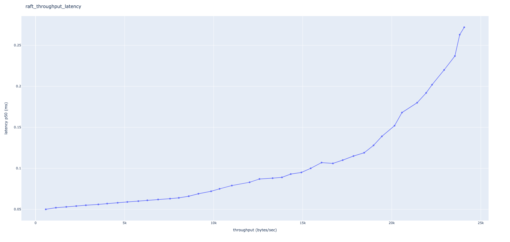
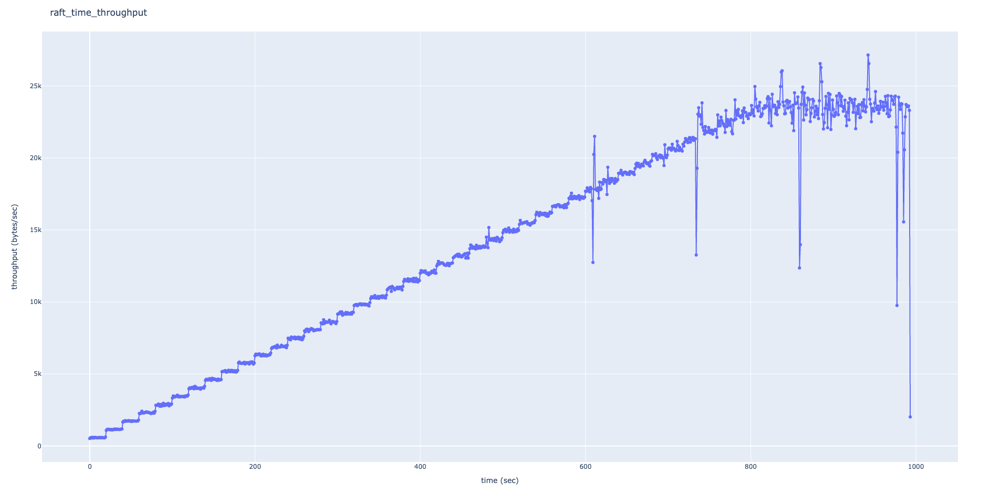

Once we have determined the RPS required for baseline performance from the graph above,
We could use the const RPS payload to re-execute the baseline to get standard latency and standard throughput.
As could be seen from the figure below, the standard latency p50 is about `0.15 (ms)`, and the standard throughput is about `20k (bytes/sec)`. Once the RPS exceeds this threshold, the latency will increase significantly, and in addition, the throughput will also fluctuate.

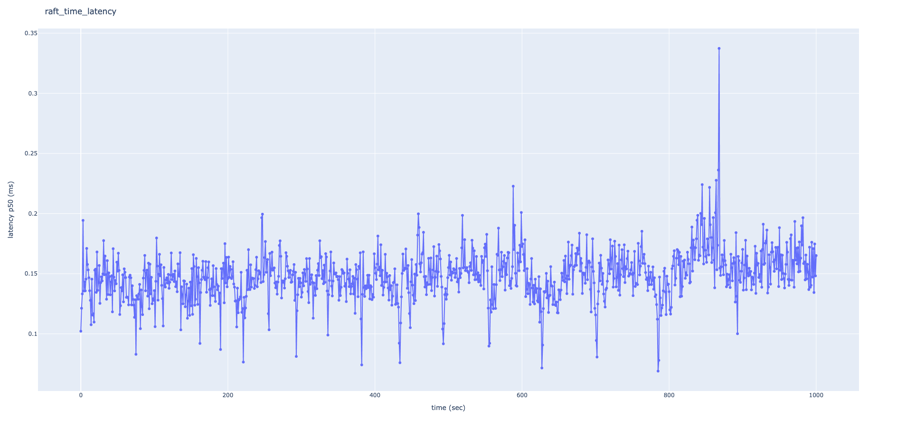
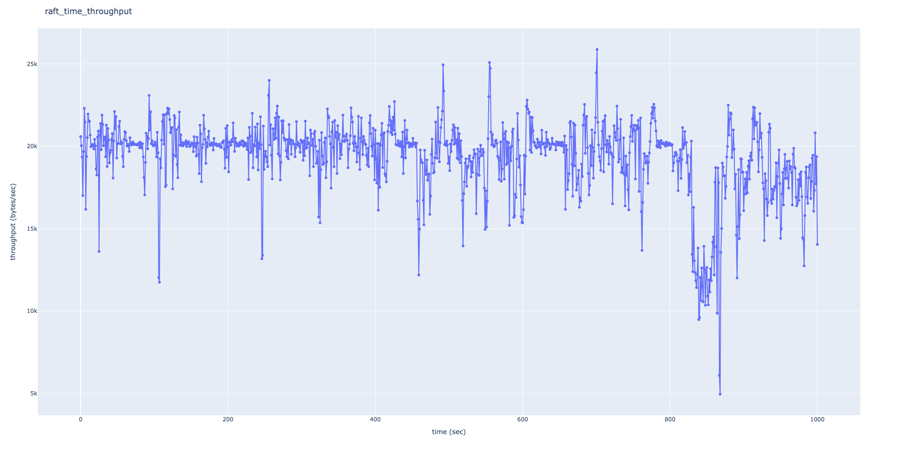

<div style="page-break-after: always;"></div>

## 3. Fail-Injection Testing

Now, let’s assess the fault tolerance of the quorum system of choice. The way we are going to do it is to inject the following types of faults during the client workload into a node:

- Crashing behavior
- Slow CPU
- Memory contention

We then measure the performance in the same way you measure your baseline performance. We will compare the performance with faults with the baseline performance (without faults). The difference indicates the fault tolerance level – ideally, there is no difference.

Please inject the above three types of faults into both a leader node and a follower node respectively. So, you will have the following 6 different cases:

- Crashing behavior on leader
- Crashing behavior on follower
- Slow CPU on leader
- Slow CPU on follower
- Memory contention on leader
- Memory contention on follower

Later, you will report the performance with the above faults and compare it with the baseline performance in each scenario.

You can choose how to simulate the three types of faults above, but you need a programmable way rather than manually doing things.

Tianyin’s group developed a xonsh-based fault-injection tool named [Slooo](https://github.com/xlab-uiuc/slooo/tree/main/faults) which already implements the faults in a simple framework,

You are welcome to use `Slooo` which implements most stuff already (it also helps the team to fix bugs and improve the `Slooo` tool). It is also perfectly fine if you don’t want to use `Slooo`, but to implement something similar yourself. You should choose what helps you the best.

Note that we do not grade your scripts/tools, but the results.

<div style="page-break-after: always;"></div>

### Q5: How do you simulate crash, slow CPU and memory contention?

Basically, I used the environment configuration as shown below.

I use the docker python sdk to implement dynamic CPU, memory quota allocation and simulate node crashes by force closing the container.
You could find the corresponding implementation in [hypervisor](./hypervisor/).
Below is a piece of code that briefly illustrates this mechanism.

```python
class VM:
    def __init__(
        self,
        name: str,
        image: str,
        command: list[str],
        network: str,
        container: Container,
    ) -> VM:
        self.name = name
        self.image = image
        self.command = [*command]
        self.network = network
        self.container = container
        self.id = self.container.id
        atexit.register(self.stop)

    # https://docs.docker.com/config/containers/resource_constraints/#cpu
    def with_slow_cpu(self, cpus: float = 0.1) -> None:
        cpu_period = 100000
        cpu_quota = int(cpu_period * cpus)
        with SuppressWithLogger(logger, DockerException):
            self.container.update(cpu_period=cpu_period, cpu_quota=cpu_quota)
        return None

    # https://docs.docker.com/config/containers/resource_constraints/#--memory-swap-details
    def with_memory_contention(
        self, mem_limit: str = "10m", memswap_limit: str = "20m"
    ) -> None:
        with SuppressWithLogger(logger, DockerException):
            self.container.update(mem_limit=mem_limit, memswap_limit=memswap_limit)
        return None

    def stop(self) -> None:
        with suppress(NotFound):
            self.container.remove(force=True)
        return None
```

<div style="page-break-after: always;"></div>

### Q6: Please plot the performance with faults on the leader node and compare it with the baseline performance

I injected the error halfway through the test.
So the figure I draw uses time as the x-axis.

We can notice that the throughput drops significantly relative to the baseline after the leader goes down,
Latency increases significantly relative to baseline.

We can notice that after the leader's CPU is slowed down, the throughput drops significantly relative to the baseline,
Latency increases significantly relative to baseline.

We can notice that after the leader memory_contention, the throughput drops significantly relative to the baseline,
Latency increases significantly relative to baseline.

time_throughtput_const_crashing_behavior_on_leader

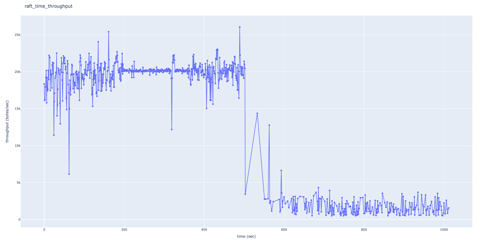

time_latency_const_crashing_behavior_on_leader

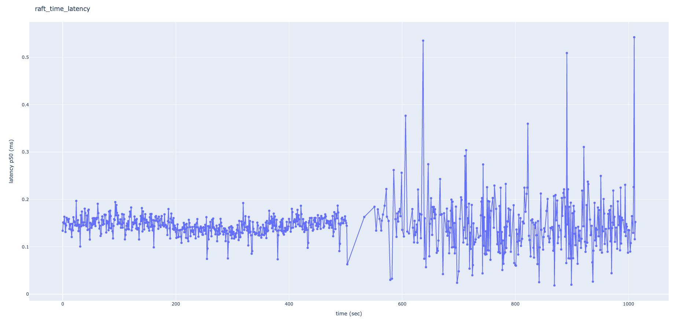

time_throughput_slow_cpu_on_leader_0_1

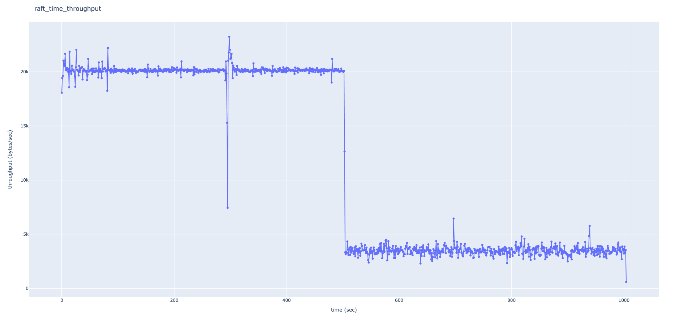

time_latency_slow_cpu_on_leader_0_1

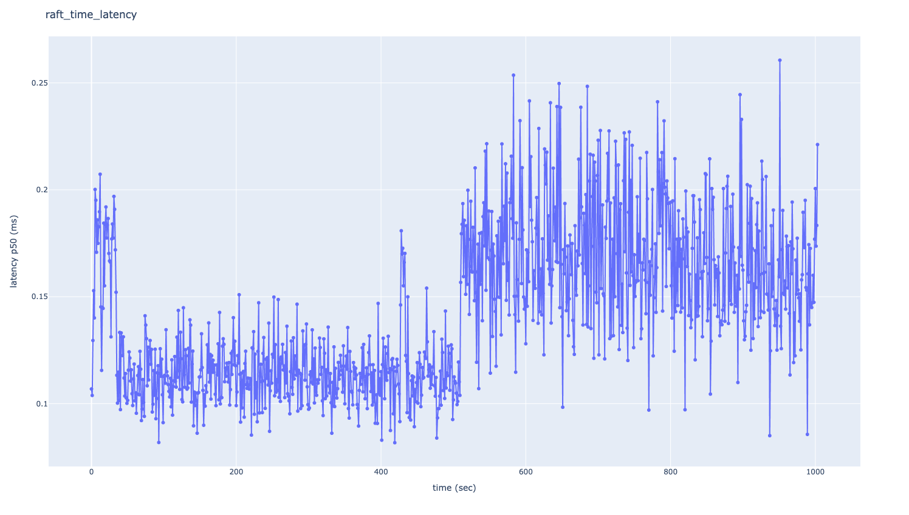

time_throughput_memory_contention_on_leader

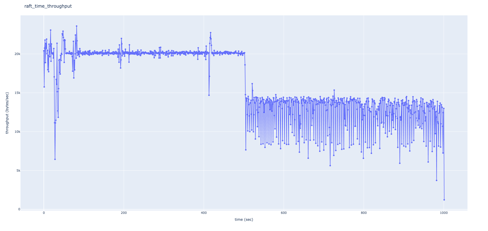

time_latency_memory_contention_on_leader

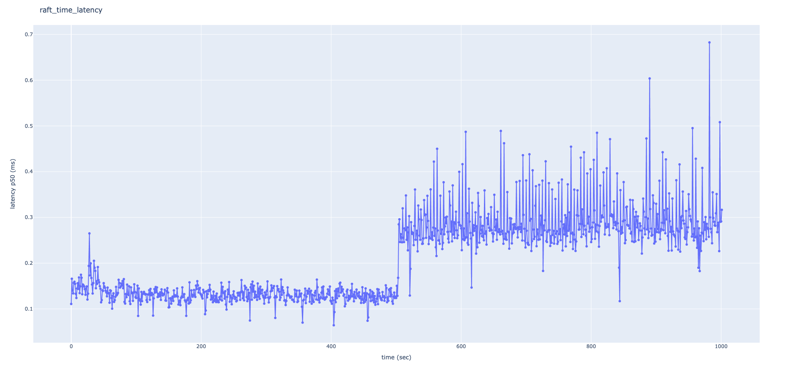

<div style="page-break-after: always;"></div>

### Q7: Please explain the above results. Is it expected? Why or why not? You will receive bonus points if you are able to pinpoint the code

Yes, the above results are basically what we expected.
In section 5.1 of the Raft paper:

> A Raft cluster contains several servers; five is a typical number, which allows the system to tolerate two failures.

In our case (Cluster Size = `3` | `5`) , even if we crashed the leader node.
Since the Raft cluster still has the majority of nodes, the Raft cluster can still remain functional.
( `(3 - 1 = 2) > (3 // 2 == 1)`)
( `(5 - 1 = 4) > (5 // 2 == 2)`)
But Leader is so important in Raft algorithm.
This is described in several places in the Raft paper.

> Strong leader: Raft uses a stronger form of leadership than other consensus algorithms. For example, log entries only flow from the leader to other servers. This simplifies the management of the replicated log and makes Raft easier to understand.

> Raft’s strong leadership approach simplifies the algorithm, but it precludes some performance optimizations. For example, Egalitarian Paxos (EPaxos) can achieve higher performance under some conditions with a leaderless approach.

> Log replication: the leader must accept log entries from clients and replicate them across the cluster, forcing the other logs to agree with its own.

> Once a leader has been elected, it begins servicing client requests. Each client request contains a commandto be executed by the replicated state machines. The leader appends the command to its log as a new entry, then issues AppendEntries RPCs in parallel to each of the other servers to replicate the entry. When the entry has been safely replicated (as described below), the leader applies the entry to its state machine and returns the result of that execution to the client. If followers crash or run slowly, or if network packets are lost, the leader retries AppendEntries RPCs indefinitely (even after it has responded to the client) until all followers eventually store all log entries.

The performance of the Leader is a bottleneck in Raft clusters when there is a Leader.
Because all messages are routed from the Leader.
When there is no Leader in the Raft cluster, all messages are backlogged in the Leader and will not be answered until the Leader is elected and most nodes have synchronized their logs.

If the Leader crashes, a re-election will be triggered after a short timeout.
This will result in a forced redirection of the client after the election.
A reduction in the Leader's CPU limit will cause the Leader to slow down.
This will slow down almost everything, especially computationally intensive blocks of code (Raft Message serialization, Raft Message deserialization, Raft state machine branching).
The reduced Leader memory limit will cause the Leader to use swap memory more frequently.
If Leader process run out of physical memory, it use virtual memory, which stores the data in memory on disk. Reading from disk is several orders of magnitude slower than reading from memory, so this slows everything way down. ) raises when a process accesses a memory page without proper preparations). And this leads to severe performance degradation.

For all the Leader error injection tests above, we can observe significant performance degradation which includes a drop in throughput and an increase in latency.
This is in line with our expectations.

---

Related code

The code below is basically a key point passing through the Happy Path execution flow from the Leader's perspective. The inconsistency between the implementation of Etcd Raft and the Raft paper has been skipped (eg PreEelection, Dynamic Cluster Config). The Snapshot process has also been skipped.

- [Calc Majority of Raft Cluster](https://github.com/etcd-io/etcd/blob/0c9a4e0f93ad9a7d83e8f5ec215baa856616c76b/raft/quorum/majority.go#L203)
- [Become Candidate](https://github.com/etcd-io/etcd/blob/0c9a4e0f93ad9a7d83e8f5ec215baa856616c76b/raft/raft.go#L695)
- [Candidate State Machine Step Switch](https://github.com/etcd-io/etcd/blob/0c9a4e0f93ad9a7d83e8f5ec215baa856616c76b/raft/raft.go#L847)
- [Candidate State Machine Step Switch](https://github.com/etcd-io/etcd/blob/1d8c06ac50998671f921c08892319963e999b9c7/raft/raft.go#L1376)
- [Candidate State Machine Step Switch - Campaign Vote Succ become Leader](https://github.com/etcd-io/etcd/blob/0c9a4e0f93ad9a7d83e8f5ec215baa856616c76b/raft/raft.go#L1407)
- [Leader Node Get Most Vote](https://github.com/etcd-io/etcd/blob/1d8c06ac50998671f921c08892319963e999b9c7/raft/raft.go#L803)
- [Become Leader](https://github.com/etcd-io/etcd/blob/1d8c06ac50998671f921c08892319963e999b9c7/raft/raft.go#L724)
- [Send Empty Append Entries Notify Others](https://github.com/etcd-io/etcd/blob/1d8c06ac50998671f921c08892319963e999b9c7/raft/raft.go#L747)
- [Leader State Machine Step Switch](https://github.com/etcd-io/etcd/blob/0c9a4e0f93ad9a7d83e8f5ec215baa856616c76b/raft/raft.go#L991)
- [Leader State Machine Step Switch - Heartbeat (Let others know that I am the Leader)](https://github.com/etcd-io/etcd/blob/0c9a4e0f93ad9a7d83e8f5ec215baa856616c76b/raft/raft.go#L995)
- [Leader State Machine Step Switch - Cluster Config Update](https://github.com/etcd-io/etcd/blob/0c9a4e0f93ad9a7d83e8f5ec215baa856616c76b/raft/raft.go#L1043)
- [Leader State Machine Step Switch - Bcast Append Log Entry](https://github.com/etcd-io/etcd/blob/0c9a4e0f93ad9a7d83e8f5ec215baa856616c76b/raft/raft.go#L1076)
- [Reelection When Past Eelection Timeout](https://github.com/etcd-io/etcd/blob/0c9a4e0f93ad9a7d83e8f5ec215baa856616c76b/raft/raft.go#L645)

<div style="page-break-after: always;"></div>

### Q8: Please plot the performance with faults on the follower node and compare it with the baseline performance

I injected the error halfway through the test.
So the figure I draw uses time as the x-axis.

We can notice that after the follower goes down, the throughput is basically unchanged relative to the baseline,
The latency is basically unchanged relative to the baseline.

We can notice that after the CPU of the follower slows down, the throughput is basically unchanged relative to the baseline,
The latency is basically unchanged relative to the baseline.

We can notice that after follower memory_contention, the throughput is basically unchanged relative to the baseline,
The latency is basically unchanged relative to the baseline.

time_throughput_const_crashing_behavior_on_follower

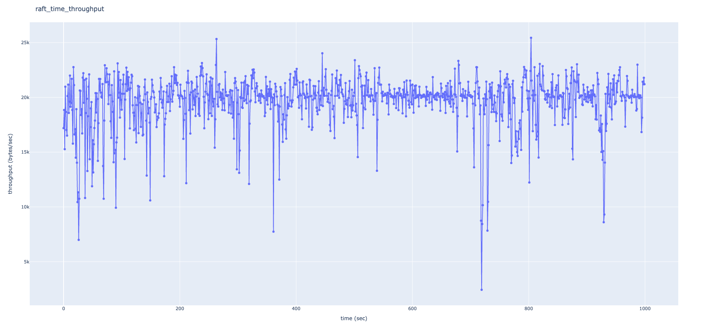

time_latency_const_crashing_behavior_on_follower

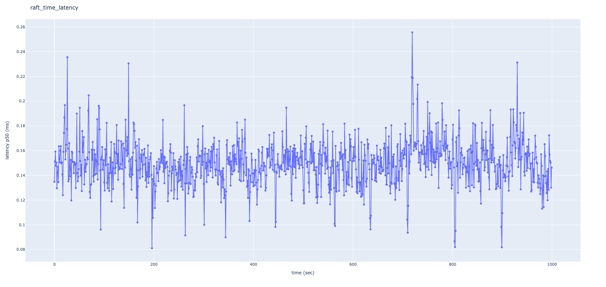

time_throughput_slow_cpu_on_follower

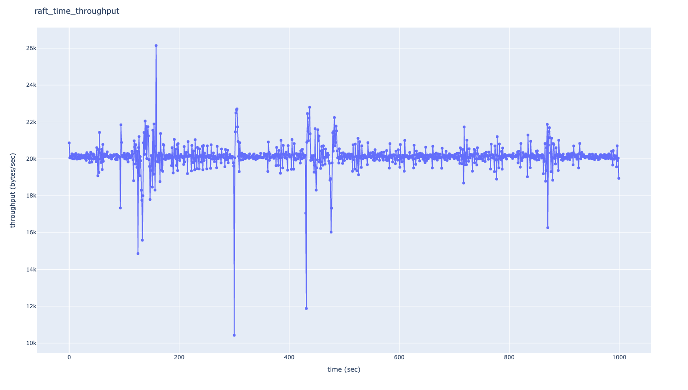

time_latency_slow_cpu_on_follower

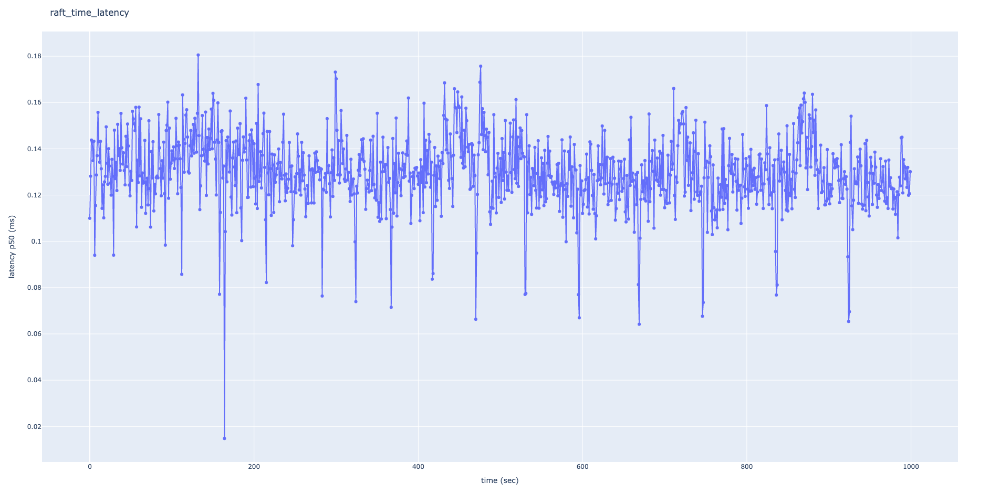

time_throughput_memory_contention_on_follower

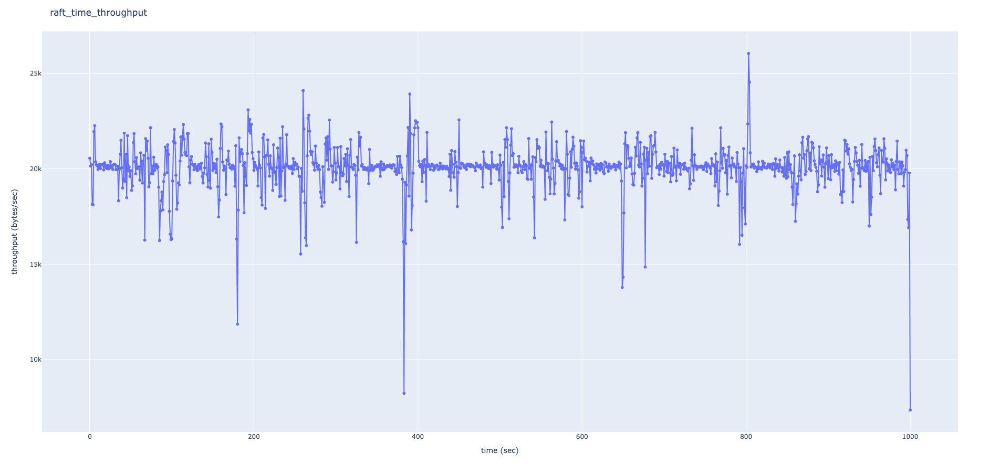

time_latency_memory_contention_on_follower

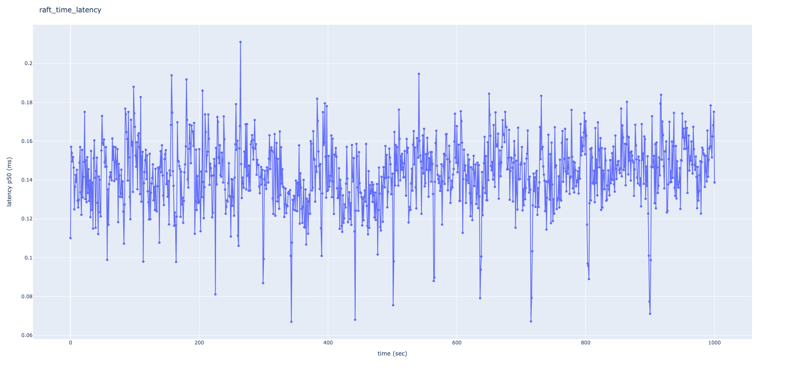

<div style="page-break-after: always;"></div>

### Q9: Please explain the above results. Is it expected? Why or why not? You will receive bonus points if you are able to pinpoint the code

As we discussed before, the Raft algorithm only needs a majority of nodes alive to guarantee functionality.
In our case, Raft will consistently remain functional.
In addition, the leader will reply to messages when the logs have been synced to most nodes.
So crashing a follower or slowing down a follower doesn't have a big impact on the performance of the entire cluster.

For all the Leader error injection tests above,
We can notice that the throughput and latency is basically unchanged relative to the baseline,
This is in line with our expectations.

Related code

The code below is basically a key point passing through the Happy Path execution flow from the Follower's perspective. The inconsistency between the implementation of Etcd Raft and the Raft paper has been skipped (eg PreEelection, Dynamic Cluster Config). The Snapshot process has also been skipped.

- [Become Candidate](https://github.com/etcd-io/etcd/blob/0c9a4e0f93ad9a7d83e8f5ec215baa856616c76b/raft/raft.go#L695)
- [Candidate State Machine Step Switch](https://github.com/etcd-io/etcd/blob/1d8c06ac50998671f921c08892319963e999b9c7/raft/raft.go#L1376)
- [Candidate State Machine Step Switch - Recv Log Append Entry become follower](https://github.com/etcd-io/etcd/blob/0c9a4e0f93ad9a7d83e8f5ec215baa856616c76b/raft/raft.go#L1391)
- [Candidate State Machine Step Switch - Recv Heartbeat become Follower](https://github.com/etcd-io/etcd/blob/0c9a4e0f93ad9a7d83e8f5ec215baa856616c76b/raft/raft.go#L1394)
- [Candidate State Machine Step Switch - Recv Snapshot become Follower](https://github.com/etcd-io/etcd/blob/0c9a4e0f93ad9a7d83e8f5ec215baa856616c76b/raft/raft.go#L1396)
- [Candidate State Machine Step Switch - Campaign Vote Succ become Follower](https://github.com/etcd-io/etcd/blob/0c9a4e0f93ad9a7d83e8f5ec215baa856616c76b/raft/raft.go#L1413)
- [Follower Reset Timeout When Recv Leader Heartbeat](https://github.com/etcd-io/etcd/blob/0c9a4e0f93ad9a7d83e8f5ec215baa856616c76b/raft/raft.go#L1438)
- [Handle Append Entries](https://github.com/etcd-io/etcd/blob/0c9a4e0f93ad9a7d83e8f5ec215baa856616c76b/raft/raft.go#L1475)

<div style="page-break-after: always;"></div>

### Q10: For the slow CPU and memory contention, could you vary the level of slowness/contention and report the results?

Of course, we just need to change the different parameters:

```python
[leader,follower].vm.with_slow_cpu([0.1, 0.2, 0.4, 0.8])
[leader,follower].vm.with_memory_contention(
  [
    (mem_limit="10m", memswap_limit="20m"),
    (mem_limit="15m", memswap_limit="25m"),
    (mem_limit="20m", memswap_limit="30m"),
    (mem_limit="25m", memswap_limit="35m"),
  ]
)
```

time_throughput_slow_cpu_on_leader_0_1


time_latency_slow_cpu_on_leader_0_1


time_throughput_slow_cpu_on_leader_0_2

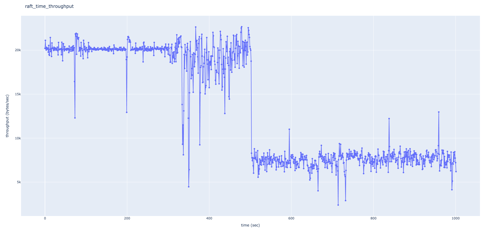

time_latency_slow_cpu_on_leader_0_2

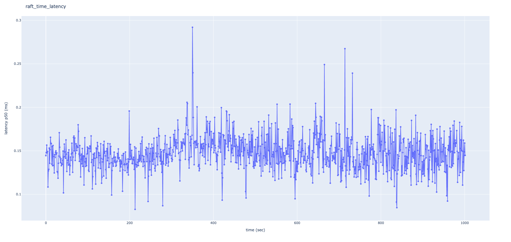

time_throughput_slow_cpu_on_follower_0_1


time_latency_slow_cpu_on_follower_0_1


time_throughput_slow_cpu_on_follower_0_2

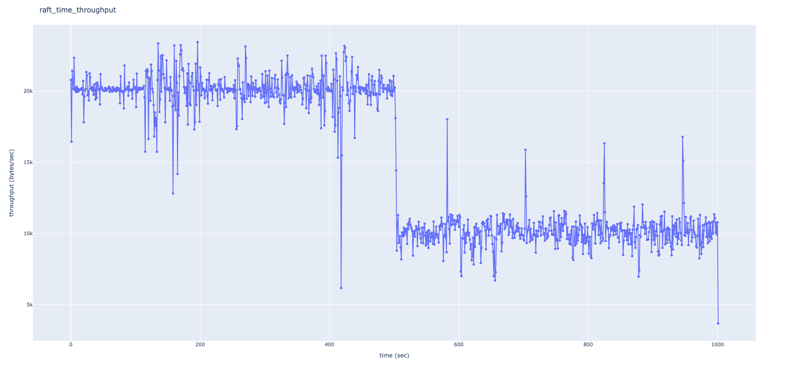

time_latency_slow_cpu_on_follower_0_2

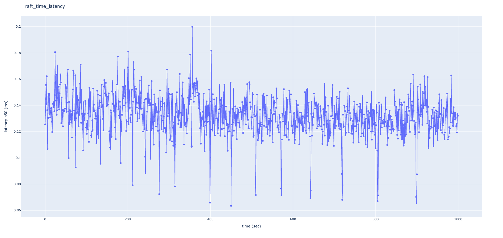

time_throughput_slow_cpu_on_follower_0_4

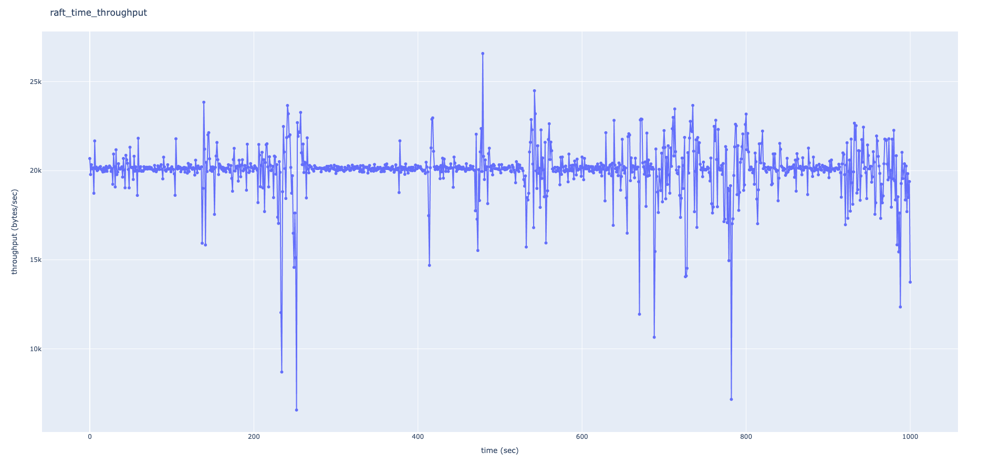

time_latency_slow_cpu_on_follower_0_4

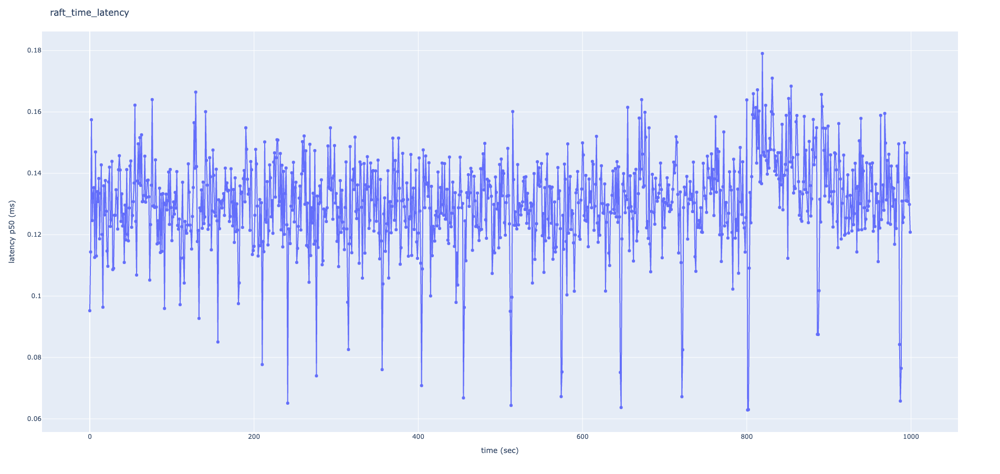

time_throughput_slow_cpu_on_follower_0_8

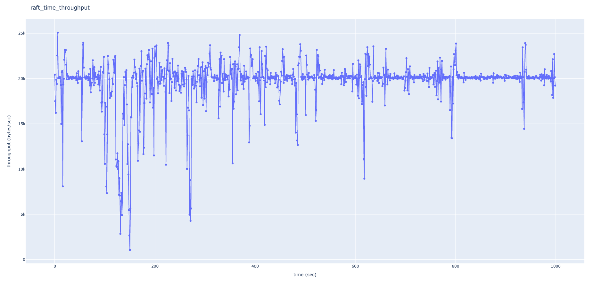

time_latency_slow_cpu_on_follower_0_8

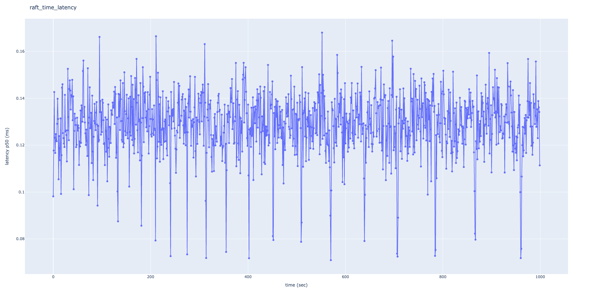

time_throughput_memory_contention_on_leader_10


time_latency_memory_contention_on_leader_10


time_throughput_memory_contention_on_leader_15

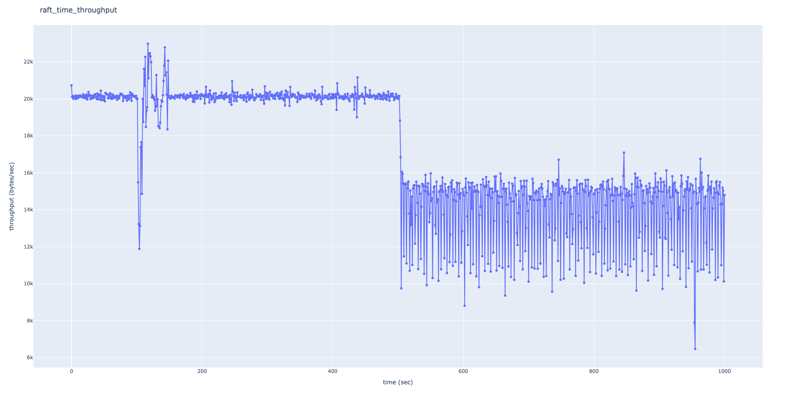

time_latency_memory_contention_on_leader_15

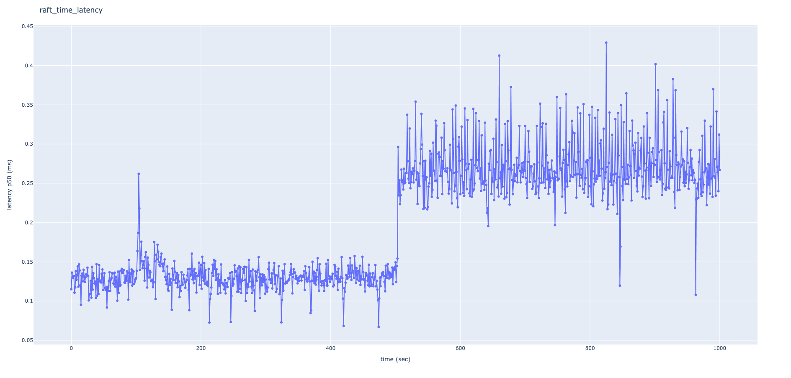

time_throughput_memory_contention_on_leader_20

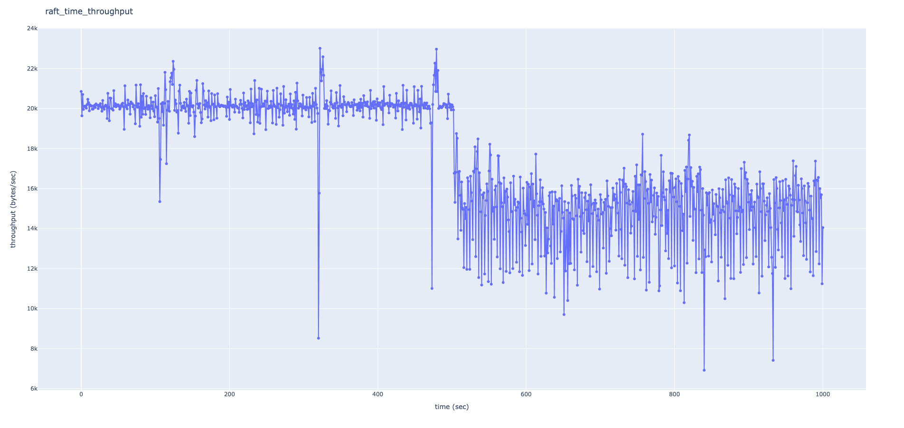

time_latency_memory_contention_on_leader_20

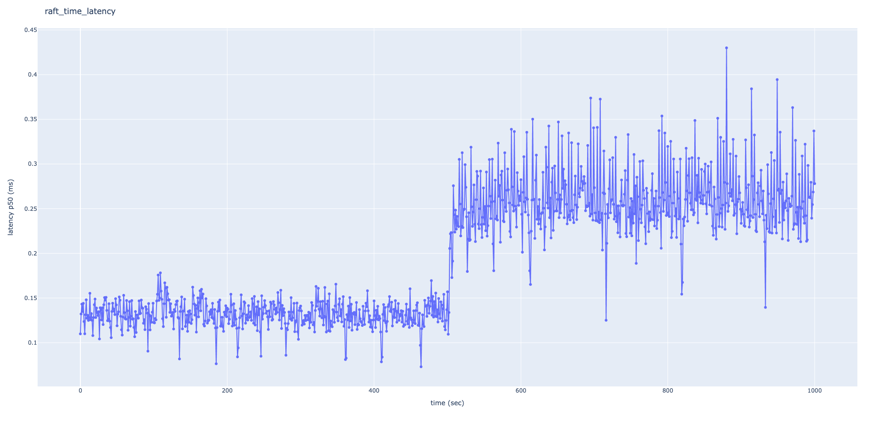

time_throughput_memory_contention_on_leader_25

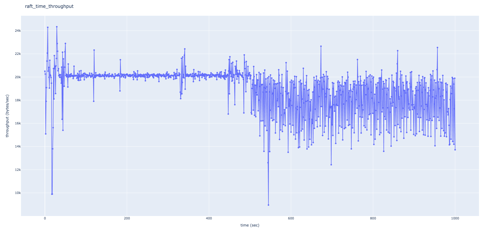

time_latency_memory_contention_on_leader_25

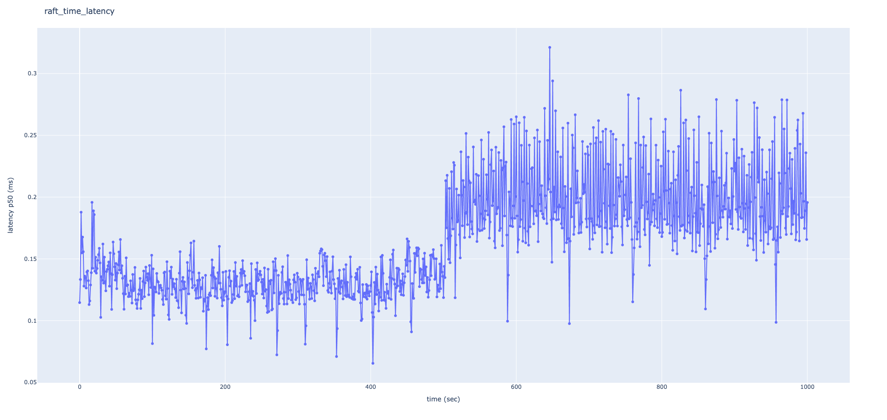

time_throughput_memory_contention_on_follower_10


time_latency_memory_contention_on_follower_10


time_throughput_memory_contention_on_follower_15

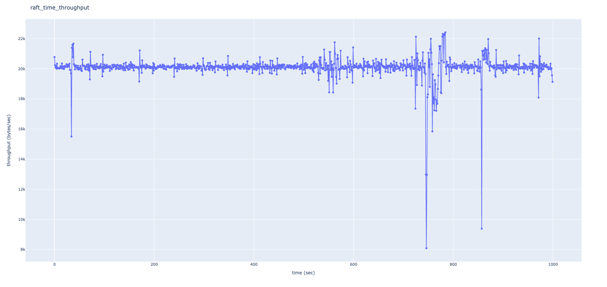

time_latency_memory_contention_on_follower_15

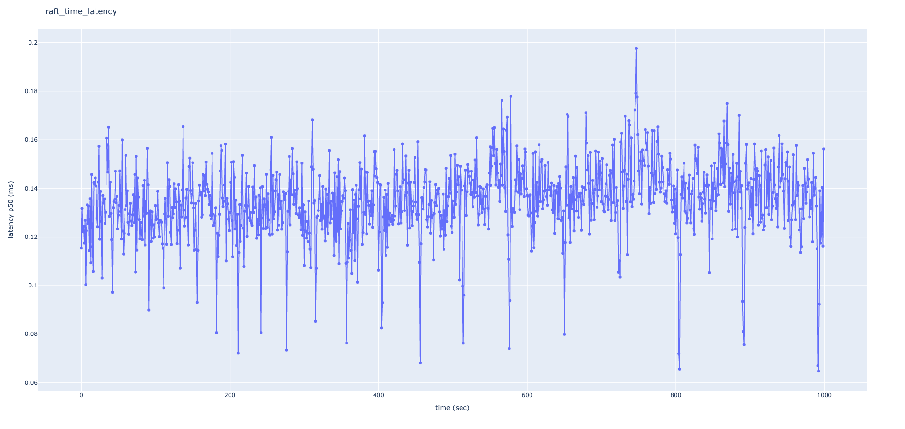

time_throughput_memory_contention_on_follower_20

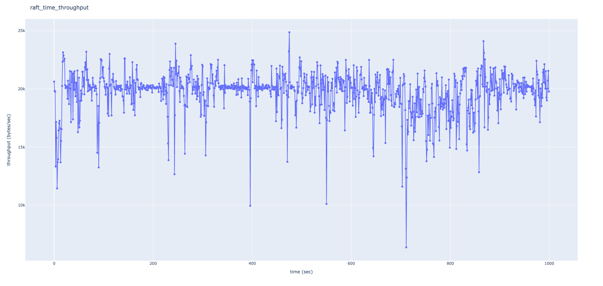

time_latency_memory_contention_on_follower_20

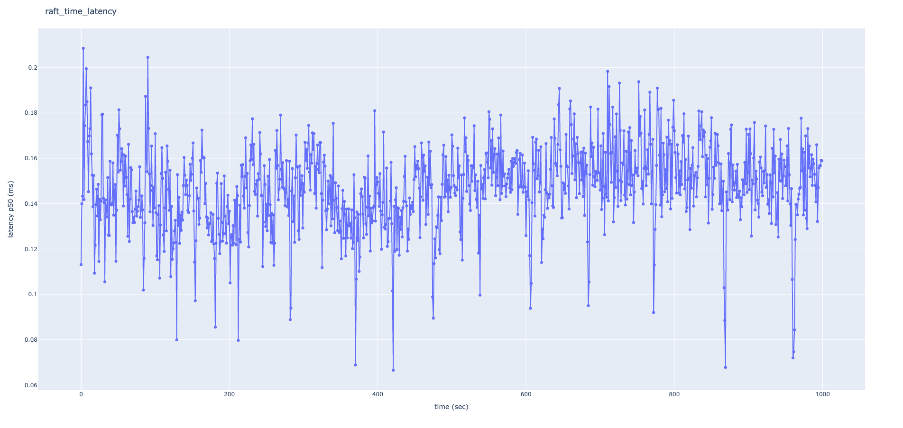

time_throughput_memory_contention_on_follower_25

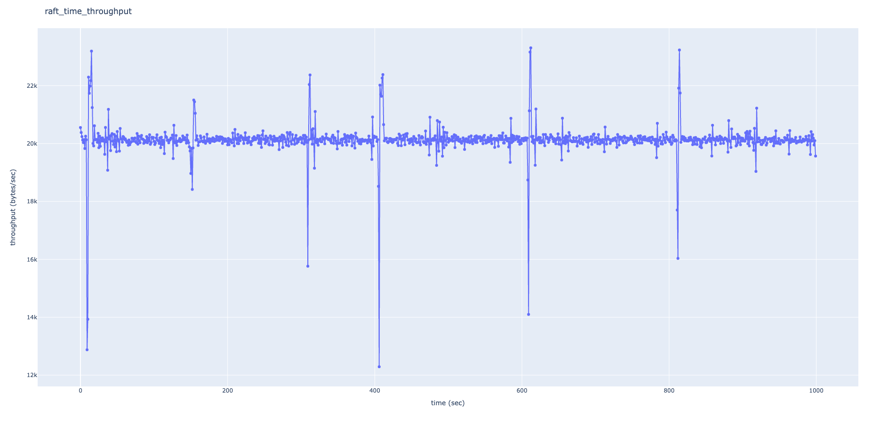

time_latency_memory_contention_on_follower_25

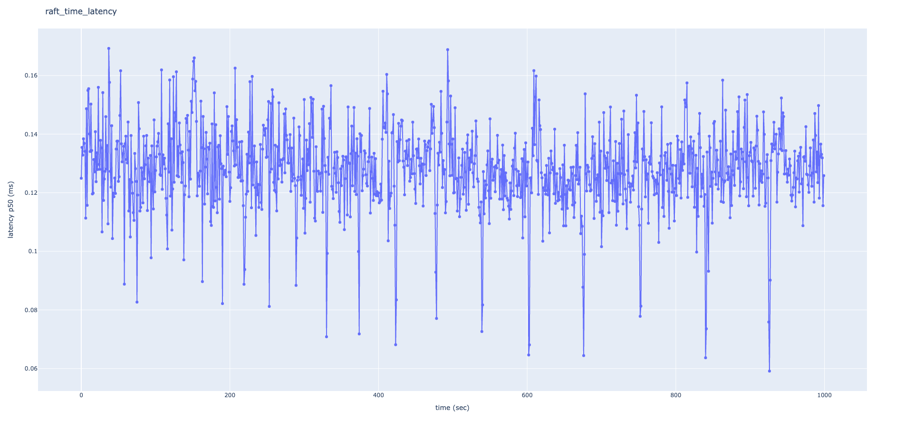
